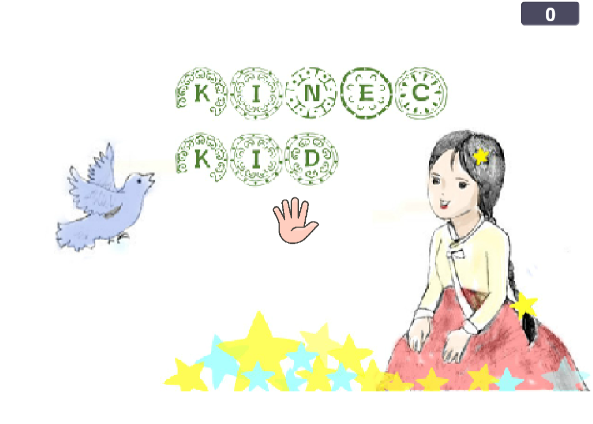
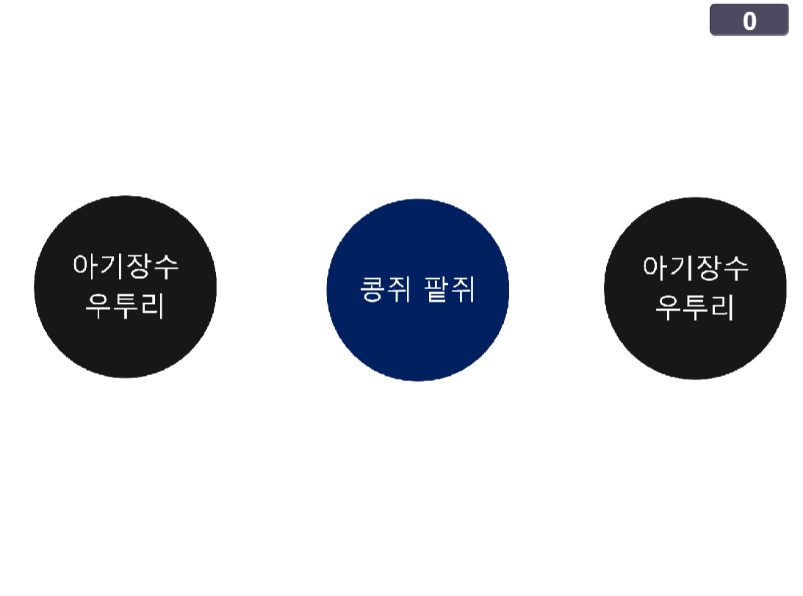
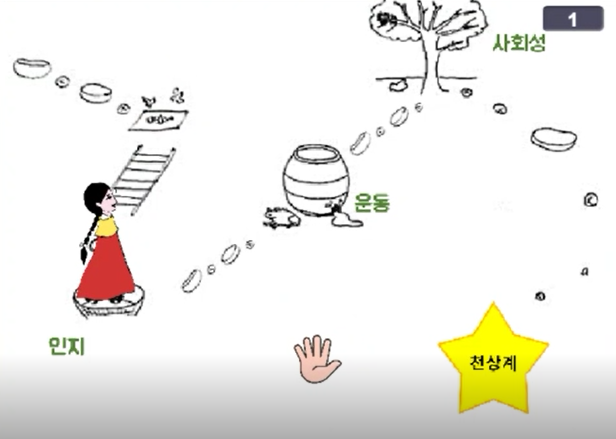
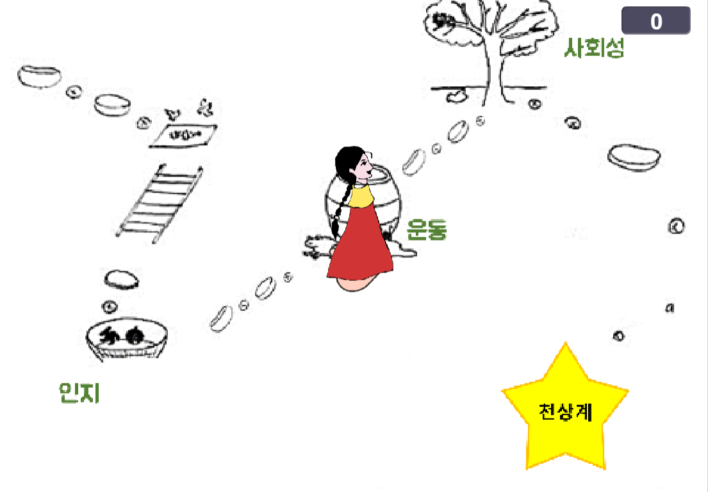
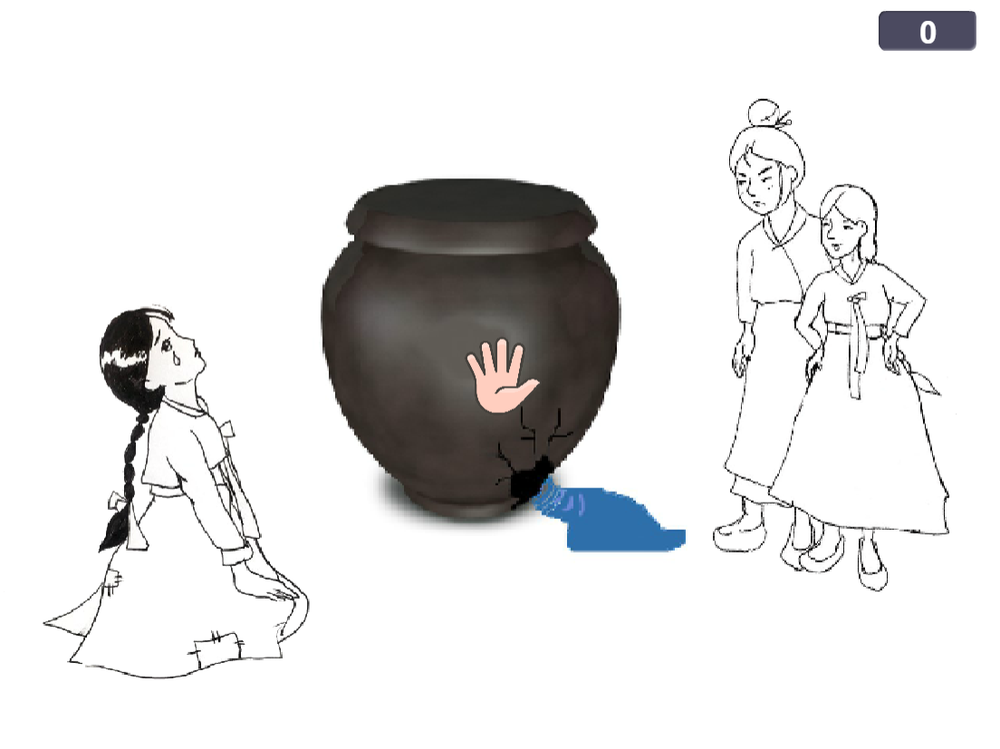
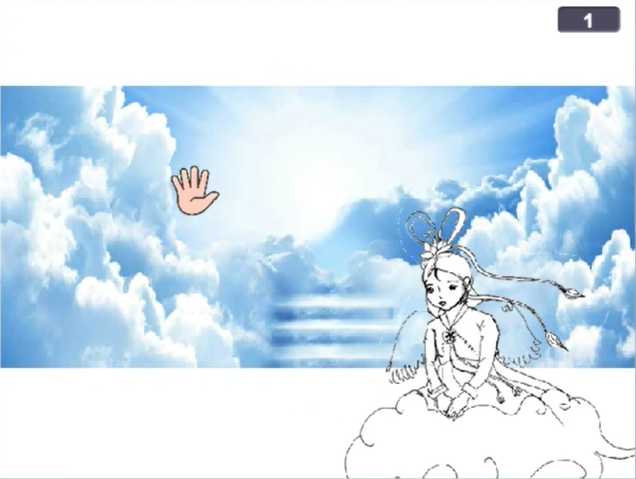

[← go back to the list](https://HandongHCI.github.io/StudentProjects/HCI2019S)

# HCI_interactive_media_art

#### Team Members
- Kinekid
- 공용현, 이기훈, 백윤정, 구예본

## Introduction
본 프로젝트 인원은 총 4명으로, 한동대학교에서 ICT 융합을 전공하고 있는 4명의 학부생으로 이루어져 있습니다. 2019학년도 1학기 HCI(이원섭 교수님)수업의 일환으로 진행중인 프로젝트입니다. 본 프로젝트(이하 Kinekid 혹은 키넥키드)는 발달성 장애(발달 지연, 발달장애, 자폐성 스펙트럼 등)를 가진 아동을 위한 미디어 아트적 성격을 가진 게임을 만드는 프로젝트입니다. 치료용 게임이 아닌 치료를 돕는 훈련성 게임임을 알려드리며, 컨텐츠 개발을 위해 현재 관련 분야에서 종사하고 계신 사회복지사 선생님들과 특수교육학과에서 공부하고 있는 학생들을 대상으로 인터뷰 진행 및 관련 논문 자료를 참조하여 컨텐츠를 제작하였습니다. 
  
Our team project is Kineckid, it means Kinect + Kid. Kinekid is a developmental training program for 5-11 year-old children who had developmental disabilities. This is our project's general process. Before we started to discuss about the project, we built 6 big steps until making high- fidelity prototype. First step is 'Customer Definition & Issue', second one is 'Specialist Interview & Problem definition' and third one is 'Concept Ideation'. And forth is 'Making a Prototype', fifth is 'Prototype Feedback', and last one is 'Making a high -fidelity prototype'.

### 1. Background
In the beginning, we discussed a lot of ideas about Kinect program. Finally, we realized that we should set one target first, and go on the process. Also, we wanted to make a game in media art that was not just a game, but socially meaningful. So we researched, and there are pretty a lot of children who have developmental disorders. Developmental disorders are diseases caused by failure to follow normal development process or by discontinuation of certain functions. The number of children with developmental disabilities continues to rise from 2013 to 2017, according to the data from the Health and Welfare Ministry's disabled registration status. However, training programs for children with developmental disabilities currently remain in utilizing 1 or 2 dimensions of data and have spatial limitations that require children to visit to relevant centers to receive training programs. Even with the exception of Seoul, access to such education is very low. And For this reason, children with developmental disabilities do not take sufficient training programs at the right time (5-11 years old) which are needed to maximize the effectiveness of their treatment. This is the statistics of the time to commute to special education school or class from home. Therefore, we are planning to develop training program for disabled children by using Kinect that can provide motion-recognition-based content. Through using this program, children can be trained their developmental status at home through interesting training programs without problem of accessibility to center.

### 2. Specialist Interview & Problem Definition.
We conducted the interviews with a large framework to find out the direction of the solution and what the children need. The solution was chosen through interviews with four people, two are experts who work in center for disabled and others are students who study on special education or social welfare. We asked them four questions about current training programs for the children who have developmental disorders, necessary skills, subject opinions, and contents of Kinect for the children. Here are the common answers from interviews. They said that the learning required for disabled children is largely exercise, cognitive skills and social skills. However, the existing programs failed to provide interest to children because they focus only on education so they did not consider real users. Through the interview, we could know existing program is 'lack of fun'. It was not user-oriented, but lesson oriented. This direction made low sustainability. So we came up with the concept of 'learning programs using fairy tales'. It will help interaction between users and programs. 
 
### 3. Concept Ideation
These are studies which can prove our project that use fairy tales. They explained effects of using fairy tale in education for children who have developmental education. They said, 'fairy tale may be the appropriate medium for proper arbitration and reinforcement of self-expression abilities' and 'When storytelling is applied to cognitive and behavioral self-expression programs, the technology of self-expression can naturally be created by infants through the role experience of the main characters in fairy tales.' Kinect, which interacts with body movements, and fairy tales will bring children freshness and fun that are different from traditional learning programs. 

### 4. Making a low fidelity prototype 
Through Build-Measure-Learn process, we choose three fairy tale stories which are '콩쥐팥쥐', '아기 장수 우투리', '유기견 흰둥이의 모험'. Based on these concept of fairy tale, low-fidelity prototype with solutions for 'recognition', 'sociality' and 'exercise' was developed. These are out prototype. With pilot test, we make up our paper prototype first, and we make a video about process of playing this program. 

### 5. Paper-prototype feedback
Since children with developmental disabilities cannot provide adequate feedback to us, so we have received feedback from three people, one expert in the field and two undergraduate students studying in this field. We sent our video and conducted online interview. Here are our strong points. It enables children to get benefits of training program at any time by provided Kinekid at home. Second is, as this program use both sound and visual image, it would help children to have better understanding.

### 6. Future work
Also we have weak point, some games need to be explained in detail, because disabled children have more difficulty understanding than we think. So we set derivation of two correction directions. One is adding more voice or sound and image instead of text descriptions, and the other is trying to align the level of the description to actual disabled children. Feedback will be arranged in the direction of ninth week. The goal is to implement the program through scratch language until the eleventh week.

   
## 세부 개발 내용
### INTRO 
#### 시작 화면
KINECT와 KID의 합성어로 네이밍했습니다. 주인공 콩쥐와 파랑새가 시작화면입니다.

#### 동화 선택 화면
KINECKID는 스토리텔링을 통해 훈련을 진행하는 컨텐츠입니다. 사용자는 여러 동화 중에서 진행하고자 하는 것을 선택합니다. 선택할 동화에 손을 3초간 올려놓으면 그 동화로 진행됩니다.

#### 스토리 화면
콩쥐팥쥐를 선택했을 시 나오는 이야기 화면입니다. KINECKID는 게임 혹은 훈련보다는 동화 속 주인공이 되는 느낌을 내고자 했습니다. 어머니를 여의고 구박받는 콩쥐는 집안일을 다 해내도록 명령 받습니다. 서러운 콩쥐를 돕기 위해 천사가 내려오고 다양한 미션을 줍니다. 이 후 게임이 진행되며 콩쥐는 다양한 미션을 해결하고 자연스럽게 훈련이 진행됩니다. 

#### STAGE
미션들은 크게 인지능력,운동 능력, 사회성 발달 영역으로 나누어집니다. 각 돌다리들은 미션을 나타내며 미션들을 성공적으로 완수하면 다음 단계로 나아갈 수 있습니다. 모든 훈련을 완수하면 STAGE의 끝으로 가 결말을 볼 수 있습니다. 동화+훈련에 게이미피케이션(Gamification)을 차용한 대표적인 화면입니다. 

   
### Story1 : 인지 훈련 (그림 맞추기)
발달 장애 아동의 인지 향상에 도움이 되고 기존에 훈련보다 흥미로운 그림 맞추기 훈련 과정을 제작하였습니다. 사용자가 우측 상단에 위치한 사과, 바나나, 리본 그림을 바구니에 담긴 틀에 맞도록 손으로 집어 이동하여 모두 맞추면 훈련이 끝나도록 설정하였습니다.

#### 이야기 설명
계모와 언니들로부터 구박을 받는 콩쥐는 하루도 쉴새 없이 일을 해야 했습니다. 어느 날 사또의 집에 방문하게 된 계모는 사또를 위한 지역의 특산품인 사과와 바나나를 준비하였고 사또의 어린 딸을 위한 리본을 준비하였습니다. 계모는 콩쥐에게 자신이 출발하기 전 바구니에 물건을 가지런히 담아 공물을 준비하라고 명령합니다. 

 

#### 구성
1. 발달장애를 가진 아동을 배려하여 그림 맞추기 화면이 업로드 되면 자동으로 게임에 대한 설명이 음성으로 나오게 됩니다. (동화 형식의 흐름을 위해 계모의 목소리로 현장감을 더했습니다.)
2. 사용자의 손을 따라 움직이는 손 모양을 활용하여 사과, 바나나, 리본 객체에 닿게 되면 손을 따라 객체가 이동하도록 설정하였습니다.
3. 정밀한 훈련을 위해 바구니에 담긴 틀 모양에 위치 좌표를 설정하여 범위 내에 객체가 들어오게 되면 성공하는 형식으로 설정하였고 올바르지 않은 틀에 들어갈 경우 효과음과 함께 다시 시도할 수 있도록 손 모양에 객체를 다시 옮기도록 설정했습니다.
4. 사용자는 하나의 객체 씩 운반하여 훈련을 수행합니다.
5. 이후 운동 훈련 스테이지로 이동합니다. 

   
### Story 2: 운동 훈련 (밑 빠진 독에 물 채우기) 
발달 장애를 가진 아동에게는 몸을 움직여 운동할 수 있는 기회가 필요합니다. 콩쥐팥쥐 이야기의 유명한 이야기인 밑 빠진 독에 물 채우기를 모티브로 운동 훈련을 제작하였습니다. 훈련 시작 전, 상황과 미션을 설명하는 계모와 콩쥐의 대화를 첨가하여 훈련의 이해를 도왔습니다.

#### 이야기 설명
계모와 언니에게 또다시 구박을 받는 콩쥐, 이번에는 독에 물을 채우라는 숙제를 받습니다. 그런데 웬걸? 독 아래에는 구멍이 뚫려있었습니다. 가여운 콩쥐는, 밑 빠진 독인 것을 알지만 그래도 성실히 물을 채우려고 합니다. 사용자는 발을 움직임으로써, 비어있는 독에 물을 채우도록 독려하였습니다. 이를 통해 사용자의 운동을 독려합니다.

 

    
1. 발을 움직였을 때, 두꺼미가 밑빠진 독의 밑을 막아 물 채우는 것을 돕습니다. 
2. 물을 채우는 단계는 총 4단계로 이루어졌으며 발을 빨리, 많이 움직일수록 물이 더욱 빨리 채워집니다. 
3. 물을 다 채울 경우 Clear 가 등장하여 다음스테이지 및 스토리로 이동합니다.
4. 모든 스테이지가 끝이 난 이후 사회성 훈련으로 이동합니다.  

   
### Story 3: 사회성 훈련 (아기새 돕기)
발달 장애를 가진 아동에게 필요한 훈련 중 하나는 ‘사회성 발달’입니다. 이야기를 통해 다른 사람과 언어나 행동을 통해 다른 사람과 상호작용 하는 것을 훈련할 수 있도록 하였습니다. 사용자와의 Interaction을 고려하여 사용자가 선택을 할 수 있도록 고려하였고,  사용자의 선택에 따라 결과를 보여주거나 행동을 하도록 합니다. 구체적으로 다른 사람이 도움을 요청하였을 때 어떤 선택을 할 지, 그에 따른 다른 사람의 부정적 혹은 긍정적 반응에 대해 경험하고 훈련할 수 있도록 이야기를 구성하였습니다. 

#### 이야기 설명
콩쥐가 길을 가던 중 울고 있는 어미새를 만나게 됩니다. 아기 새가 둥지에서 떨어지게 되었는데 이대로 있다가 족제비에게 잡아먹히게 될 것이라며 콩쥐에게 아기새를 둥지로 올려달라고 도움을 요청합니다. 콩쥐는 어미새의 요청에 팝업창으로 뜨는 Yes 혹은 No를 손을 올려 선택할 수 있습니다. 선택한 결과에 따라 어미새의 반응을 보여주고 사용자가 선택한 결과에 따라 행동을 취함으로써 어미새와 상호작용 하는 것 같은 경험을 줄 수 있도록 만들었습니다.

1. 어미새의 도움 요청이 끝나면  NO / YES 창이 뜨게 됩니다. 콩쥐는 자신이 선택하고자 하는 팝업창 위에 손을 3초 이상 올려 선택을 할 수 있습니다.
2. NO를 선택하는 경우, 콩쥐는 어미새의 도움 요청을 거절하는 것이 되고 도움 요청을 거절당한 어미새가 울면서 콩쥐를 화를 내는 장면이 나옵니다. 다시 이야기의 처음으로 돌아가 다시 선택을 할 수 있도록 합니다.

3. 다시 어미새가 콩쥐에게 떨어진 아기새를 둥지로 올려달라고 요청하고 YES를 선택합니다. YES를 선택하면 아기새에게 손을 가져가 둥지까지 올립니다.
4. 도움을 준 콩쥐에게 어미새는 고마움을 표현하고 스테이지가 끝나게 됩니다. 

 

5. 모든 스테이지가 끝나면 이야기가 마무리 되고 콩쥐는 선녀가 되어 하늘로 올라갑니다. 

### 의의:
- 기존 장애 아동 치료,훈련에 사용되던 교육도구는 지루하고 앉아서 진행되던 활동이 많았습니다. 그러나 KINECKID는 큰 활동량을 요구하며 게임 형식으로 동기부여가 크므로 아동의 참여도가 높습니다.
- 치료를 위해 관련 센터에 다니며 지속적인 케어를 받는 것이 가장 좋지만, 접근성이 떨어집니다. KINECKID는 실내에서 최소한의 공간만 있으면 언제든 훈련이 가능합니다. 날씨와 접근성 등에 구애받지 않습니다.
- VR,모션인식 기기 등에서 가장 중요한 것은 컨텐츠입니다. 수많은 동화 내러티브가 존재하므로 추후 컨텐츠 잠재력이 높습니다.
- 스토리를 가공하고 직접 그려넣는 과정에서 미디어아트의 영역을 만족합니다.

### 한계
- 장애의 범주와 타겟을 명확히 할 필요가 있습니다. 아동의 장애 유형과 심각도에 따라 활동수행의 스펙트럼도 다릅니다. 또한 앉아서 진행하는 것이 편한 아동과 큰 활동이 요구되는 아동 등 상황이 다릅니다. 타겟을 세분화하고 동화 별로 레벨을 다르게 하는 식으로 개선이 필요합니다.
- 동화와 미션이 아직 적어 컨텐츠의 풍성함이 필요합니다. 

   
[← go back to the list](https://HandongHCI.github.io/StudentProjects/HCI2019S)