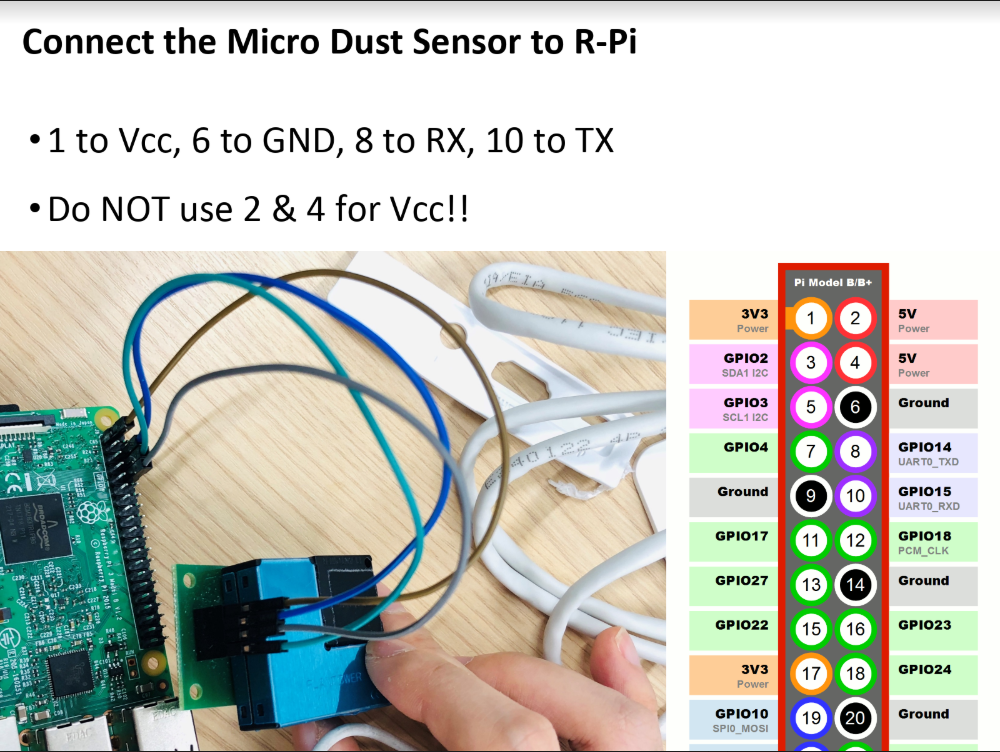
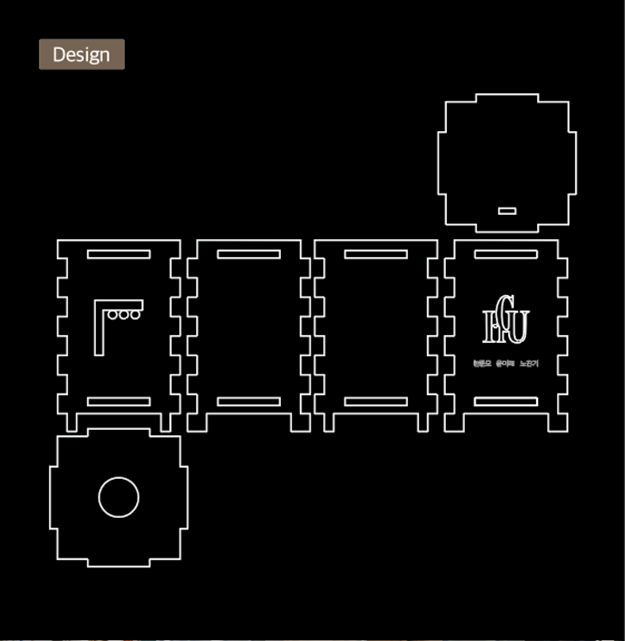
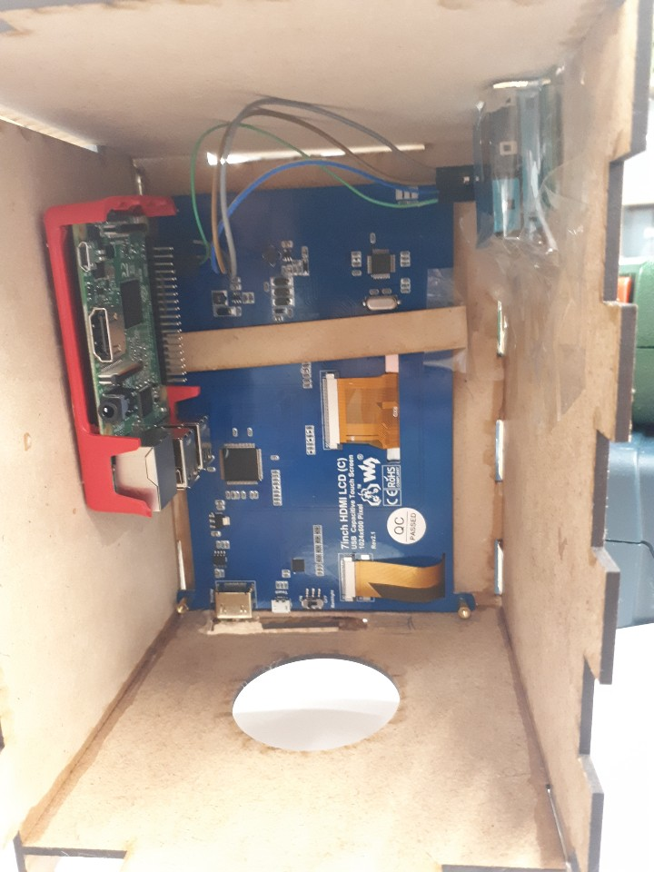
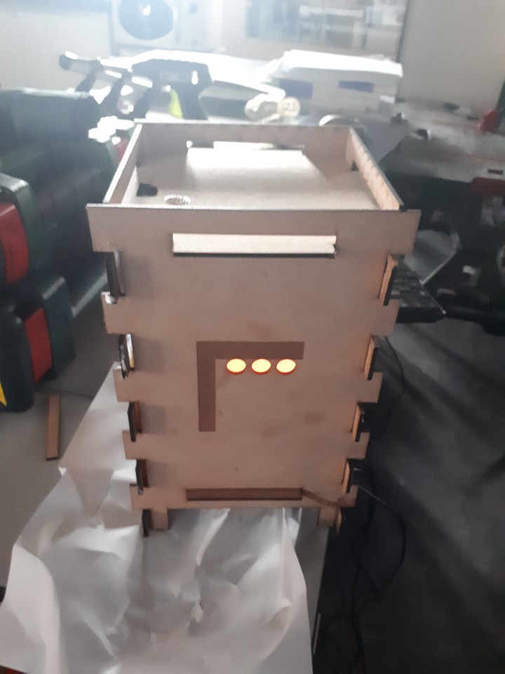

[← go back to the list](https://HandongHCI.github.io/StudentProjects/ICTprototyping2019S)

# 미세먼지 신호등 제작과정

#### Members
한준모, 노진기, 윤이레

## Background & objective 
사용자들은 다양한 날씨 어플리케이션으로 지역의 미세먼지 농도를 확인할 수 있다. 하지만 그 정보들은 실외에 대한 정보만 제공하고 사용자들이 거주하는 실내의 정보는 제공하지 못한다. 우리팀은 라즈베리파이와 미세먼지 센서를 통하여 실내의 미세먼지 농도를 측정하여 주는 제품을 제작하기로 했다. 

## Step-by-step tutorial
### 1. 라즈비안 설치
- 라즈베리 파이에 라즈비안을 설치한다. [라즈비안 설치](https://www.raspberrypi.org/) 
- 7인치 모니터 사용을 위하여 라즈비안이 설치된 드라이브에서 ```config.txt```의 가장 아래에 다음과 같이 추가한다.
```
# setting for 7-inch LCD display
max_usb_current=1
hdmi_group=2
hdmi_mode=87
hdmi_cvt 1024 600 60 6 0 0 0 #해상도
hdmi_drive=1
```

- 미세먼지 프로젝트를 위해 bluetooth를 끈다. ```config.txt```의 가당 아래에 다음과 같이 추가한다.
```
# Turn off BlueTooth
dtoverlay=pi3-disable-bt
enable_uart=1
```

- 라즈베리 설치 파일의 `cmdline.txt`의 내용을 다음과 같이 바꾼다.
```
dwc_otg.lpm_enable=0 console=ttyAMA0,115200 kgdboc=ttyAMA0,115200 console=tty1 root=/dev/mmcblk0p2 rootfstype=ext4 elevator=deadline rootwait
```

자세한 설치 방법과 미세먼지 프로젝트를 위한 라즈비안 세팅은 링크를 참조한다. [Stting Raspbian on Raspberry Pi3](https://github.com/HandongHCI/HandongHCI.github.io/blob/master/Tutorials/Raspbian.md)[라즈베리파이](https://www.raspberrypi.org/)

    
### 2. 미세먼지 센서 연결하기
- 센서를 연결하기 앞서서 터미널에서 다음과 같은 과정을 실행한다.
```
sudo raspi-config
```
설정창이 열리면 `5 Interfacing Options` > `P5 Serial` > `No` > `Yes` 순으로 선택한다.

```
sudo chmod g+r /dev/ttAMA0
sudo reboot
```

재부팅된 후에 아래와 같이 명령한다. 결과로서 `crw--rw----`가 출력되어야 한다.
```
ls -l /dev/ttAMA0
```

- 센서와 라즈베리 파이 연결
아래 사진과 같이 센서와 라즈베리파이를 연결한다.


(사진출처 : 한동대학교 ICT융합특론 수업자료)
    
### 3. 프로그래밍
다음은 미세먼지 센서로 미세먼지 농도를 측정하고 농도에 따라 모니터에 색을 띄우기 위한 파이썬 코드이다.  
미세먼지 농도의 기준은 WHO의 미세먼지 기준으로 4단계로 나누었고 미세먼지는 5초에 한번씩 미세먼지를 측정하도록 하였다.
- code_micro_dust.py 파일을 다운로드한다.
- cs1graphics.py를 같은 파일에 저장한다.  
  
다음은 라즈베리파이가 실행될 때마다 pigpiod와 파이썬 코드와 자동으로 실행되도록 하는 코드이다. 제품 실행에 불필요한 부품(마우스, 키보드)을 제거하기 위함이다. 
```
sudo nano /home/pi/.bashrc
```

마지막 라인에 다음과 같이 추가한다.
```
echo Running at boot
sudo pigpiod
sudo python3 /home/pi/sample.py # code_micre_dust의 경로를 입력하면 된다.
```

### 4. 케이스 제작 및 조립
케이스는 레이저 커팅을 사용하였다. 제작된 케이스 안에 전원 선이나 HDMI 케이블을 모두 넣어 외관상으로 깔끔한 제품을 만들고 싶었다.
- 레이저 커팅 도면  


    
- 모니터를 먼저 앞쪽에 고정을 하고 위, 아래, 옆면을 글루건이나 본드로 붙인다. 그 후 미세먼지 센서 라즈베리 파이를 케이스의 안쪽에 고정한다.   
- 케이스의 뒤쪽 부분은 풀로 접찹시키지 않고 자유롭게 열 수 있도록 만든다.

 
  
- 완성품  
미세먼지 센서로 미세먼지 농도를 측정하고 농도에 따라 파랑색<초록색<주황색<빨강색 으로 신호등의 색을 변화시키는 제품이다.


     
## Conclusion
미세먼지 신호등은 미세먼지 농도에 따른 색의 변화를 통해 사용자들에게 미세먼지 농도에 대해 알려주고자 만든 제품이다. 모니터를 사용하여 제품을 만든만큼 다양한 제품을 시도해 볼 수 있을 것이다. 우리팀은 모니터의 색을 변화시키는 방법을 사용했지만 더 나아가 모니터에 미세먼지 농도에 따른 마스크 필요여부, 현재 농도에서의 위험성 설명과 같은 미디어를 출력하는 방식의 제품을 만들 수도 있을 것이다. 모니터를 활용한 제품인만큼 다양한 발전가능성을 가진 제품이라고 생각한다.

## Source Code
- [Here](https://github.com/HandongHCI/HandongHCI.github.io/tree/master/StudentProjects/ICTprototyping2019S/Team2/source)

<br><br><br>
[← go back to the list](https://HandongHCI.github.io/StudentProjects/ICTprototyping2019S)